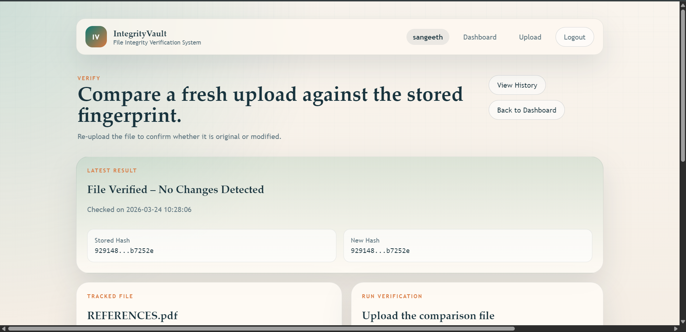

# 🛡️ File Integrity Verification System


A professional Flask web application for storing trusted file fingerprints, comparing uploaded files with SHA-256, and helping users quickly confirm whether a file has been modified.


## 📚 Table of Contents

- [Features](#-features)
- [Screenshots](#-screenshots)
- [Demo](#-demo)
- [Installation](#-installation)
- [Usage](#-usage)
- [Deployment](#-deployment)
- [Environment Variables](#-environment-variables)
- [Project Structure](#-project-structure)
- [Security](#-security)
- [Future Improvements](#-future-improvements)
- [Author](#-author)

## ✨ Features

- SHA-256 hashing for reliable file fingerprint generation
- File comparison workflow for match or mismatch verification
- User authentication with secure password hashing
- Optional encryption for stored hash values
- Responsive UI for desktop, tablet, and mobile devices
- SQLite database for lightweight persistent storage
- Render-ready deployment with `gunicorn`

## 🖼️ Screenshots

> Replace these placeholders with your final project screenshots if needed.




## 🌐 Demo

Live demo placeholder: `https://file-integrity-z8xz.onrender.com`

## ⚙️ Installation

1. Clone the repository

```bash
git clone https://github.com/sangeethsanthosh-git/file-integrity.git
cd file-integrity
```

2. Create a virtual environment

```bash
python -m venv venv
```

3. Activate the virtual environment

Windows:

```bash
venv\Scripts\activate
```

macOS/Linux:

```bash
source venv/bin/activate
```

4. Install dependencies

```bash
pip install -r requirements.txt
```

5. Run the application

```bash
python app.py
```

6. Open the app in your browser

```text
http://127.0.0.1:5000
```

## 🚀 Usage

1. Register a user account or log in to an existing account.
2. Upload a file to store its trusted SHA-256 fingerprint.
3. Open the verification flow for that tracked file.
4. Upload a comparison file and review the result.
5. Confirm whether the file is unchanged or modified.

## ☁️ Deployment

### Render Deployment

1. Push the project to GitHub.
2. Create a new Render Web Service and connect the repository.
3. Use the build command below:

```bash
pip install -r requirements.txt
```

4. Use the start command below:

```bash
gunicorn app:app
```

5. Add the required environment variables in Render.
6. If you want persistent SQLite storage on Render, mount a Persistent Disk and point `DATABASE_PATH` to that location.

Example persistent database path:

```text
/var/data/file_integrity.db
```

### Gunicorn Start Command

```bash
gunicorn app:app
```

### Render Environment Variables

```bash
SECRET_KEY=your-strong-secret-key
ENABLE_HASH_ENCRYPTION=false
HASH_ENCRYPTION_KEY=your-fernet-key
DATABASE_PATH=/var/data/file_integrity.db
```

## 🔐 Environment Variables

| Variable | Required | Description |
| --- | --- | --- |
| `SECRET_KEY` | Yes | Flask secret key used for session security |
| `ENABLE_HASH_ENCRYPTION` | No | Enables encrypted storage for hashes when set to `true` |
| `HASH_ENCRYPTION_KEY` | Conditional | Required when `ENABLE_HASH_ENCRYPTION=true`; must be a valid Fernet key |
| `DATABASE_PATH` | No | Custom path to the SQLite database file |

## 🗂️ Project Structure

```text
file-integrity/
├── app.py
├── schema.sql
├── requirements.txt
├── runtime.txt
├── Procfile
├── README.md
├── PROJECT_DOCUMENTATION.md
├── docs/
│   └── images/
├── static/
│   ├── css/
│   │   └── styles.css
│   └── js/
│       └── app.js
├── templates/
│   ├── base.html
│   ├── dashboard.html
│   ├── history.html
│   ├── login.html
│   ├── register.html
│   ├── upload.html
│   └── verify.html
├── uploads/
└── utils/
    ├── encryption.py
    ├── hash_utils.py
    └── __init__.py
```

## 🛡️ Security

This project focuses on integrity verification rather than file storage trust alone.

- Each tracked file is fingerprinted with SHA-256.
- Verification works by hashing the uploaded comparison file and comparing it with the stored trusted hash.
- A matching hash means the file has not changed.
- A different hash signals that the file may have been modified.
- Stored hashes can optionally be encrypted using Fernet-based encryption from the `cryptography` package.
- Authentication protects user-specific file records and verification workflows.

## 🔮 Future Improvements

- PostgreSQL support for production-grade deployments
- Docker support for containerized setup
- REST API for upload and verification workflows
- Email alerts for file mismatch events

## 👤 Author

- **Name:** Sangeeth Santhosh SA
- **GitHub:** https://github.com/sangeethsanthosh-git
- **LinkedIn:** https://www.linkedin.com/in/sangeethsanthoshsa
