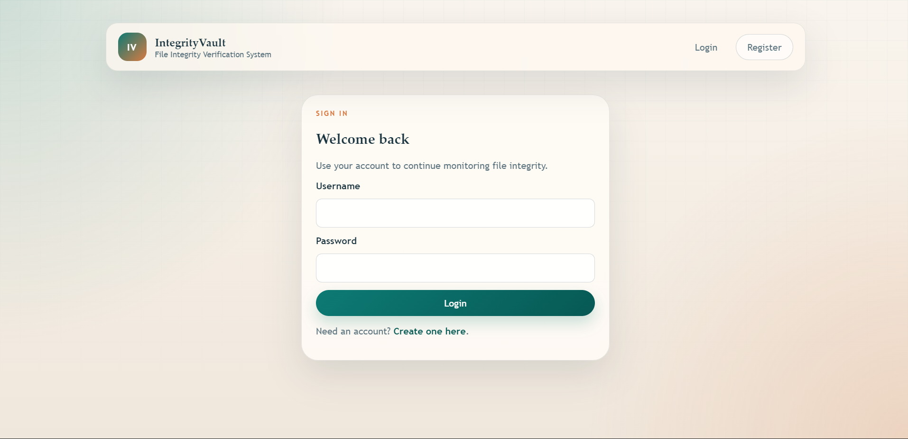
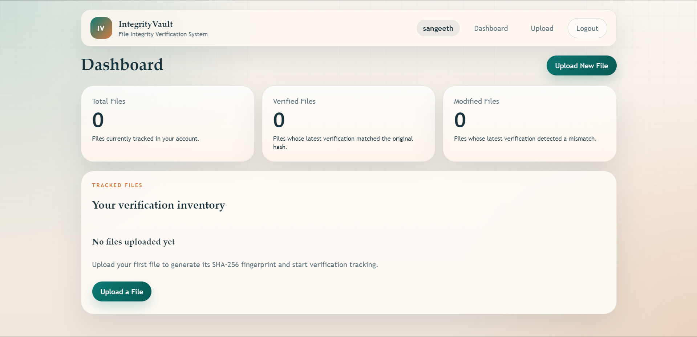
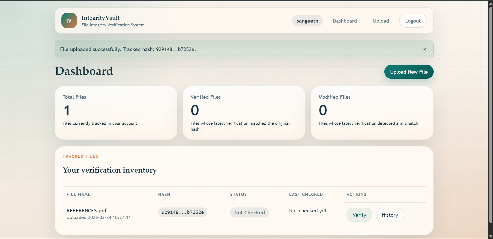
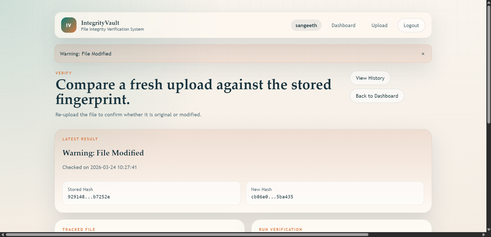
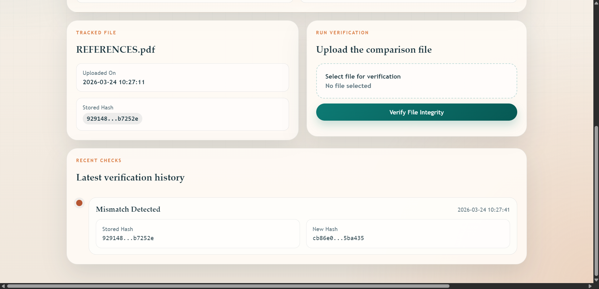

# File Integrity Verification System


A professional Flask-based web application for registering trusted file fingerprints, verifying file integrity with SHA-256, managing verification history, and optionally protecting stored hash values with encryption.

---

## Table of Contents

- [Features](#features)
- [Screenshots](#screenshots)
- [Demo](#demo)
- [Installation](#installation)
- [Usage](#usage)
- [Deployment](#deployment)
- [Environment Variables](#environment-variables)
- [Project Structure](#project-structure)
- [Security](#security)
- [Future Improvements](#future-improvements)
- [Author](#author)

---

<a id="features"></a>
## 🚀 Features

- SHA-256 hashing for reliable file fingerprint generation.
- File verification by comparing newly uploaded files against stored fingerprints.
- User authentication with secure password hashing and session-based access control.
- Verification history with timestamped results and shortened hash comparisons.
- Responsive HTML/CSS interface for desktop, tablet, and mobile devices.
- Optional encryption support for stored hash values using `cryptography`.
- SQLite database with automatic schema initialization.

---

<a id="screenshots"></a>
## 🖼️ Screenshots

### Login Page


### Dashboard


### Upload Page


### Verification Page


### History Page


---

<a id="demo"></a>
## 🌐 Demo

Live demo placeholder: https://file-integrity-z8xz.onrender.com

---

<a id="installation"></a>
## ⚙️ Installation

### 1. Clone the Repository

```bash
git clone https://github.com/sangeethsanthosh-git/file-integrity.git
cd file-integrity
```

### 2. Create a Virtual Environment

```bash
python -m venv venv
```

Windows:

```bash
venv\Scripts\activate
```

macOS/Linux:

```bash
source venv/bin/activate
```

### 3. Install Dependencies

```bash
pip install -r requirements.txt
```

### 4. Run the Application

```bash
python app.py
```

The app runs locally at:

```text
http://127.0.0.1:5000
```

---

<a id="usage"></a>
## 🧭 Usage

1. Register a new user account.
2. Log in to access your private dashboard.
3. Upload a file to generate and store its SHA-256 fingerprint.
4. Re-upload a file later to verify whether it matches the original.
5. Review verification history and integrity results from the dashboard and history pages.

---

<a id="deployment"></a>
## 🚀 Deployment

### Render Deployment

1. Push the project to GitHub.
2. Create a new **Web Service** in Render and connect your repository.
3. Ensure the project uses **Python 3.11.0**. This repository includes both `runtime.txt` and `.python-version`.
4. Set the **Build Command** to:

```bash
pip install -r requirements.txt
```

5. Set the **Start Command** to:

```bash
gunicorn app:app
```

6. Add the required environment variables listed below.
7. For persistent SQLite storage on Render, attach a **Persistent Disk** and point `DATABASE_PATH` to that disk, for example:

```text
/var/data/file_integrity.db
```

8. Deploy the service.

### Gunicorn Start Command

```bash
gunicorn app:app
```

### Recommended Render Environment Variables

```bash
SECRET_KEY=your-strong-random-secret
ENABLE_HASH_ENCRYPTION=false
HASH_ENCRYPTION_KEY=your-fernet-key-if-encryption-is-enabled
DATABASE_PATH=/var/data/file_integrity.db
```

---

<a id="environment-variables"></a>
## 🔐 Environment Variables

| Variable | Required | Description |
| --- | --- | --- |
| `SECRET_KEY` | Yes | Flask session secret key. Always set this in production. |
| `ENABLE_HASH_ENCRYPTION` | No | Enables encrypted storage for hashes when set to `true`. |
| `HASH_ENCRYPTION_KEY` | Conditional | Required when `ENABLE_HASH_ENCRYPTION=true`. Must be a valid Fernet key. |
| `DATABASE_PATH` | No | Optional path to the SQLite database file. Useful for Render Persistent Disks. |

Example:

```bash
SECRET_KEY=replace-me-with-a-secure-secret
ENABLE_HASH_ENCRYPTION=false
HASH_ENCRYPTION_KEY=
DATABASE_PATH=file_integrity.db
```

---

<a id="project-structure"></a>
## 🗂️ Project Structure

```text
File Integrity Verification System/
|-- app.py
|-- schema.sql
|-- requirements.txt
|-- runtime.txt
|-- Procfile
|-- .python-version
|-- README.md
|-- PROJECT_DOCUMENTATION.md
|-- file_integrity.db
|-- docs/
|   `-- images/
|-- static/
|   |-- css/
|   |   `-- styles.css
|   `-- js/
|       `-- app.js
|-- templates/
|   |-- base.html
|   |-- dashboard.html
|   |-- history.html
|   |-- login.html
|   |-- register.html
|   |-- upload.html
|   `-- verify.html
|-- uploads/
`-- utils/
    |-- __init__.py
    |-- encryption.py
    `-- hash_utils.py
```

---

<a id="security"></a>
## 🛡️ Security

This project is designed to help detect unauthorized file changes by using SHA-256 hashing for integrity verification.

- When a file is uploaded, the application computes a SHA-256 hash and stores the resulting fingerprint.
- During verification, a new SHA-256 hash is generated from the uploaded comparison file.
- If the new hash matches the original stored hash, the file is considered unchanged.
- If the hashes differ, the application flags the file as modified.
- Stored hashes can optionally be encrypted using the `cryptography` package and a Fernet key.
- Authentication is session-based, and users can only access their own tracked files and verification history.

---

<a id="future-improvements"></a>
## 🔮 Future Improvements

- PostgreSQL support for production-grade database hosting.
- API endpoints for programmatic uploads and verification.
- Docker support for containerized deployment.
- Email alerts for integrity mismatches and verification notifications.

---

<a id="author"></a>
## 👤 Author

- **Name:** Sangeeth Santhosh SA
- **LinkedIn:** https://www.linkedin.com/in/sangeethsanthoshsa
- **GitHub:** https://github.com/sangeethsanthosh-git

---

If you use this project, feel free to customize the banner and add your live deployment URL.
